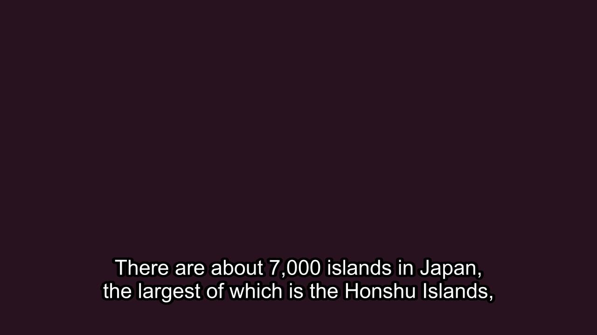
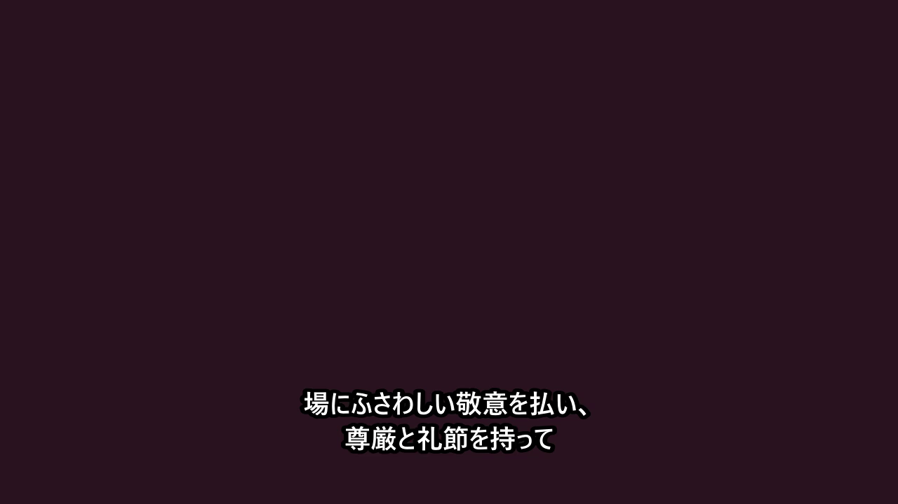
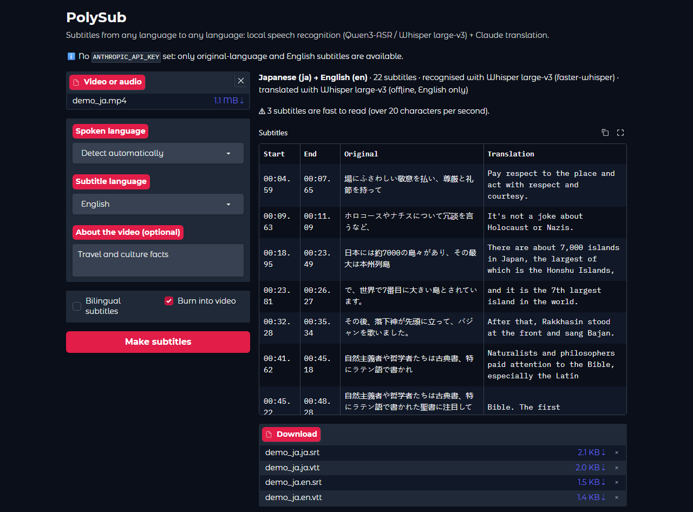

# PolySub: subtitles from any language to any language

Turn speech in any video into accurate, well-timed subtitles, in the original language or translated into
another one: Japanese → English, English → Hindi, Hindi → English, and so on.

- **Speech recognition runs locally on your GPU**, choosing the more accurate open model for each language
  **based on measurements**: **Qwen3-ASR-1.7B** with **Qwen3-ForcedAligner-0.6B** (word-level timing), or
  **Whisper large-v3** (about 100 languages, including Hindi, Malayalam, Tamil and Arabic).
- **Translation by Claude**, cue by cue, so every translated line keeps its original timing, with earlier
  lines as context so names and tone stay consistent.
- **Professional subtitle rules:** at most two lines, line lengths per language, breaks at pauses and
  sentence ends, a minimum time on screen, and no overlaps.
- **Outputs:** SRT, WebVTT, **bilingual** subtitles (translation + original), and the video with subtitles
  **burned in**.
- **Measured accuracy** on Google's FLEURS benchmark (below), and 43 automated tests.

A real run on the demo video (2 minutes of Japanese speech from FLEURS, offline mode, RTX 4060):

```text
$ python -m polysub demo_ja.mp4 --to en --burn

PolySub
  File        demo_ja.mp4 (1.1 MB)
  From        detect automatically
  To          English (en)

> Detecting the language...
> Recognising Japanese speech... 100%
> Translating to English with Whisper... 100%
> Adding the subtitles to the video...

Done
  Language    Japanese (ja)
  Recognised  Whisper large-v3 (faster-whisper)
  Translated  Whisper large-v3 (offline, English only)
  Subtitles   22 cues
  Length      1m 54s
  Time taken  30s
  Saved       demo_ja.ja.srt
              demo_ja.en.srt
              demo_ja.subtitled.mp4
```

| Burned-in English | Burned-in Japanese |
|---|---|
|  |  |

The web page (`python -m polysub.web`) after the same job: original and translation side by side, with the
files to download:



## How it works
```
video ──FFmpeg──▶ 16 kHz audio ──Whisper──▶ detect language (first 30 s)
      ──router──▶ Qwen3-ASR + aligner │ Whisper large-v3   (whichever measured better for the language)
      ──▶ timed words ──▶ subtitle cues ──Claude──▶ translated cues (same timing)
      ──▶ .srt / .vtt / bilingual / burned-in video
```
1. **FFmpeg** decodes the audio from any video or audio format.
2. If the language isn't given, **Whisper** detects it from the first 30 seconds.
3. **Routing by evidence** (`polysub/languages.py`):
   - **Our own measurements first:** English → Qwen, Japanese → Whisper (see Accuracy below).
   - **Published benchmarks next:** Qwen3-ASR beats Whisper on multilingual averages, so the other
     languages its aligner can time (Chinese, Cantonese, French, German, Italian, Korean, Portuguese,
     Russian, Spanish) go to Qwen.
   - **Everything else** (Hindi, Malayalam, Tamil, Arabic and about 90 more) goes to Whisper large-v3.
4. **Long audio** is cut into ≤170-second pieces at the quietest moment, so no word is split (the aligner
   handles up to 180 s per call).
5. **Words are cleaned up before they become subtitles:**
   - The aligner drops punctuation and hyphens, so each word is rebuilt as written in the transcript.
   - Whisper's sub-word pieces are merged into whole words.
   - Japanese is split into real words with `nagisa`, so lines never break inside a word.
   - For Japanese and Chinese, a punctuated example prompt makes Whisper write 。and 、(94 marks instead of
     42 on the test clips, with no loss of accuracy).
   - Then words become **subtitle cues** following common style-guide rules.
6. **Claude** translates the cues in numbered batches of 40. A JSON schema guarantees one translation per
   cue, so nothing shifts out of sync. A missing line is asked for again, and the cost is estimated from
   token usage.
7. Only one model is kept on the GPU at a time, so it all fits in 8 GB.

## Accuracy (measured)
FLEURS dev set (Google's multilingual benchmark, CC-BY 4.0), different sentences read by real speakers, on an
RTX 4060. Lower is better. WER = word error rate; CER = character error rate (used for Japanese, which has
no spaces). Text is normalised (case and punctuation) before scoring. Speed = seconds of audio processed
per second.

| Language | Clips | Qwen3-ASR-1.7B + aligner | Whisper large-v3 | PolySub uses |
|---|---|---|---|---|
| English (WER) | 90 | **3.8%** · 5.2× | 4.2% · 11.8× | Qwen |
| Japanese (CER) | 90 | 5.4% · 4.8× | **4.1%** · 10.5× | Whisper |
| Hindi (WER) | 30 | cannot time Hindi | 25.6% · 4.9× | Whisper |

**What this showed:**
- **Published benchmarks predict Qwen for both** English and Japanese.
- **English agrees:** Qwen wins.
- **Japanese doesn't:** Qwen made real recognition mistakes, such as 伐採 (logging) → 発売 (product
  release), so PolySub routes Japanese to Whisper.
- **Punctuation trade-off:** the Japanese prompt that adds punctuation costs 0.3 points (3.8% → 4.1%). It's
  kept on purpose, because punctuated subtitles read much better.
- **A bug found and fixed:** a first run scored Qwen's English at 6.5%. The cause was my own code: hyphens
  were lost when rebuilding words from the aligner. That was fixed before these numbers, and is covered by
  tests.

Reproduce it with `python -m polysub.evaluate DATA_DIR --language ja`, where DATA_DIR holds audio files and
matching `.txt` transcripts.

## Setup
Needs Python 3.10+, [FFmpeg](https://ffmpeg.org/download.html) on your PATH, and an NVIDIA GPU (8 GB is
enough; CPU works but is very slow).

```bash
python -m venv .venv
.venv\Scripts\activate                     # Windows (source .venv/bin/activate on macOS/Linux)
pip install torch --index-url https://download.pytorch.org/whl/cu128
pip install -r requirements.txt
set ANTHROPIC_API_KEY=your-key             # for translation (export ... on macOS/Linux)
```
The models download on first use (Qwen3-ASR 4.7 GB, aligner 1.8 GB, Whisper large-v3 3.1 GB). Without an
API key you can still make subtitles in the original language and English subtitles (Whisper's own
translation).

## Usage
```bash
python -m polysub episode.mkv --to en                  # any language -> English
python -m polysub lecture.mp4 --from en --to hi        # English -> Hindi
python -m polysub vlog.mp4 --to en --bilingual --burn  # + bilingual file + video with subtitles
python -m polysub talk.mp4 --to ja --format srt,vtt --context "Tech talk; speaker Priya; terms: Kubernetes, Django"
python -m polysub.web                                  # web page at http://127.0.0.1:7860
```

| Option | Meaning |
|---|---|
| `--to` | Subtitle language, code or name (default `en`) |
| `--from` | Spoken language (default: detect automatically) |
| `--engine` | `auto` (default), `qwen` or `whisper` |
| `--translator` | `auto` (default), `claude` (any language) or `whisper` (English only, offline) |
| `--format` | `srt`, `vtt` or `srt,vtt` |
| `--bilingual` | Also write subtitles with the original under the translation |
| `--burn` | Also save the video with the subtitles burned in |
| `--context` | A sentence about the video, names or terms: guides both recognition and translation |
| `-o` | Output folder (default: next to the input) |
| `-q` | Print nothing except errors |

Optional settings: `POLYSUB_MODEL` (default `claude-opus-5-5`) and `POLYSUB_EFFORT` (default `medium`).

## Tests
```bash
pip install -r requirements-dev.txt
pytest
```
43 tests cover language routing, chunking at quiet moments, punctuation repair, subtitle rules, SRT/VTT/
bilingual output, translation batching (complete, retried, refused and malformed replies), cost
estimates, the full pipeline and the command line. The models and Claude are replaced by stand-ins, so the
tests run in under a second with no GPU, downloads or API key, which is how CI runs them.

## Project structure
```
polysub/
  languages.py   language names, routing, line lengths
  audio.py       FFmpeg decoding, chunking at quiet moments
  asr.py         QwenEngine, WhisperEngine, EnginePool (one model on the GPU at a time)
  cues.py        timed words -> subtitle cues (rules, wrapping, timing fixes, punctuation repair)
  translate.py   Claude translation (batches, JSON schema, retries, cost)
  subtitles.py   SRT, WebVTT, bilingual
  burn.py        burn subtitles into the video (FFmpeg)
  pipeline.py    the whole job, shared by the CLI and the web page
  cli.py, web.py command line and Gradio web page
  evaluate.py    WER/CER evaluation
tests/           43 tests with fake engines and a fake Claude client
```

## Limitations
- **Offline mode:** Whisper's built-in English translation has its own, looser timing, so a sentence can
  occasionally be split across two subtitles. Claude translation keeps every cue's original timing.
- **Translation quality** depends on Claude and hasn't been scored yet. A reference set with a translation
  metric (e.g. COMET) is the next step.
- **Hindi accuracy** (Whisper large-v3, 25.6% WER on FLEURS) is much lower than Japanese or English. Qwen3-ASR
  recognises Hindi but its aligner can't time it yet.
- **No speaker labels** (diarization), and no noise removal for very noisy recordings.
- **Hardware:** fast on an NVIDIA GPU; very slow on CPU.

## Credits
Qwen3-ASR and Qwen3-ForcedAligner by Alibaba Qwen (Apache-2.0) · Whisper by OpenAI (MIT) via
[faster-whisper](https://github.com/SYSTRAN/faster-whisper) · Evaluation audio:
[FLEURS](https://huggingface.co/datasets/google/fleurs) (CC-BY 4.0).
